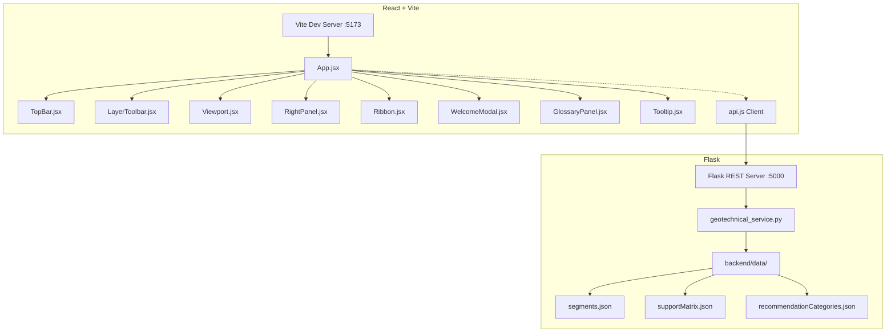

# STRATA — Geological Behaviour Prediction Platform

This repository contains the refactored, production-style architecture of the STRATA Geological Behaviour Prediction Platform. The application has been converted from a monolithic single-file HTML layout into a modular React (Vite) frontend and a Flask (Python) REST API backend.

All visual designs, spacing, typography, colors, animations, and interactive behaviors are preserved with 100% parity to the original dashboard.

---

## Architecture Overview

The system is separated into a presentation-agnostic Flask backend service and a modular React frontend.



---

## Directory Structure

```
strata/
├── package.json                   # Frontend npm package dependencies & scripts
├── vite.config.js                 # Vite build settings & dev server proxy
├── index.html                     # Frontend HTML entry mounting page
├── .env                           # Frontend environment variables
├── README.md                      # Project documentation (this file)
├── src/
│   ├── main.jsx                   # React DOM render entry point
│   ├── App.jsx                    # Primary app coordinator & state lifter
│   ├── config.js                  # Central frontend configuration & feature flags
│   ├── index.css                  # Clean, consolidated application-wide stylesheet
│   ├── services/
│   │   └── api.js                 # Unified HTTP request handler (only module that knows HTTP exists)
│   └── components/
│       ├── TopBar.jsx             # Logo headers, project selector, and excavation statistics
│       ├── LayerToolbar.jsx       # Interactive layer/overlay toggling toolbar chips
│       ├── Viewport.jsx           # SVG Geological Profile visualizer & ChNav player controls
│       ├── RightPanel.jsx         # Project Overview dashboard / ordered geotechnical metrics panel
│       ├── Ribbon.jsx             # Chainage Risk Ribbon slider with mouse drag/click controls
│       ├── WelcomeModal.jsx       # Onboarding user overlay dialog
│       ├── GlossaryPanel.jsx      # Sidebar glossary dictionary panel
│       └── Tooltip.jsx            # Event-delegated, viewport-clamped hovering tooltip box
└── backend/
    ├── app.py                     # Flask server, API routing, and static production hosting
    ├── .env                       # Backend environment variables
    ├── requirements.txt           # Python backend dependencies
    ├── data/                      # Extracted static JSON datasets
    │   ├── segments.json          # Chainage-wise predictions & metrics database
    │   ├── supportMatrix.json     # NATM engineering support metrics specs
    │   └── recommendationCategories.json # Accordion formatting specifications
    └── services/
        └── geotechnical_service.py # Decoupled data fetching and parsing service layer
```

---

## Configuration & Environment Variables

The project separates configuration from business logic and avoids hardcoded URLs by utilizing environment variables:

### Frontend Environment Variables (`.env`)
- `VITE_API_BASE_URL`: Base API hostname (defaults to empty `""` for same-origin routing in development and production).

### Backend Environment Variables (`backend/.env`)
- `FLASK_ENV`: Deployment mode (`development` or `production`).
- `PORT`: Server port (defaults to `5000`).
- `MODEL_API_URL`: Address of the future ML prediction pipeline service.
- `LLM_API_KEY`: API credential token for future LLM integration.

---

## Installation & Running Instructions

### Prerequisites
- **Node.js** (v18.0.0 or higher)
- **Python** (3.8 or higher)

### 1. Setup Backend REST API
Navigate to the workspace root and install backend python packages:
```bash
pip install -r backend/requirements.txt
```
To run the Flask backend server locally:
```bash
python backend/app.py
```
The server will boot on `http://127.0.0.1:5000` and listen for API queries.

### 2. Setup Frontend Client
Install npm packages in the workspace root:
```bash
npm install
```

#### Run in Development Mode
To launch the Vite development server with hot-module reloading (HMR):
```bash
npm run dev
```
Open `http://localhost:5173/` in your browser. All requests sent to `/api/*` will be proxied automatically to the Flask backend running on port `5000`.

#### Run in Production Mode (Render-Compatible)
To compile the production assets:
```bash
npm run build
```
Vite will compile the code and output the bundle to the root `dist/` directory.

Once compiled, you can access the production-ready site directly at the Flask server endpoint: `http://127.0.0.1:5000/`. Flask is configured to serve the root-level `dist/` directory, allowing deployment on a single Render instance.

---

## Key Refactoring Design Decisions

1. **State Lifting**: Primary states governing active sections (`currentSegIdx`), active geological layers (`layerState`), autoplay status (`isPlaying`), and project configurations are managed within `App.jsx` and distributed down to components as props.
2. **Selectors & Derived Values**: Aggregate metrics (excavation completion percentage, hazard distributions, dominant ground type metrics) are computed dynamically using `useMemo` blocks inside `RightPanel.jsx` instead of duplicating states. This avoids state synchronization bugs.
3. **Decoupled API Operations**: Components do not call `fetch()` directly. All HTTP requests are structured inside `src/services/api.js`.
4. **Native SVG Declarations**: The geological profile and ribbon elements render natively as JSX elements (`<polygon>`, `<rect>`, `<line>`, `<text>`) mapping coordinate math dynamically, avoiding string concatenations and browser-level `innerHTML` overrides.
5. **Tooltip Capsule**: `Tooltip.jsx` mounts the body-level `#appTooltip` tag and registers event delegation listeners for hover (`mouseover`/`mouseout`) on mounting, keeping components clean of custom hover parameters.
6. **Accordion State**: Accordion cards manage their expanded toggle states (`expandedAccordions`) using native React state variables, interacting directly with underlying CSS height classes.
